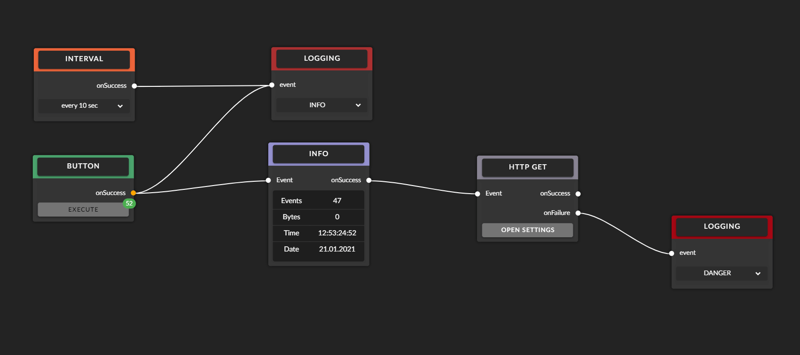

# Master-Code

Application to showcase concepts and ideas for event-based data processing.
Focusing on user-interaction and user-feedback to improve the understanding of thedata flow.
 

## Backend
Data processing backend written in JavaScript/TypeScript executed by NodeJS.
## Frontend
Written in VueJS.
Node-Editor based on [BaklavaJS](https://github.com/newcat/baklavajs).
