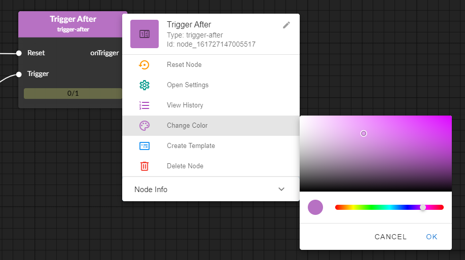

# data-graph

Application to showcase concepts and ideas for event-based data processing.
It incorporates concepts of NodeRED and ApacheNiFi and focuses on user-interaction and user-feedback to improve the users understanding of the data flow.  
Features:
* Realtime traffic indication
* Realtime error indication
* Multiple node inputs/outputs
* Interactive node editing
* Focus on usability and UX
 





## Backend
Data processing backend written in JavaScript/TypeScript executed by NodeJS.
## Frontend
Written in VueJS.
Node-Editor based on [BaklavaJS](https://github.com/newcat/baklavajs).


# Deployment

The application is fully dockerized and ca be started with ```docker-compose up```.
* The frontend and the backend are initially built. 
* Redis and MongoDB are pulled from DockerHub.


# Development

NodeJS > v12 required and npm required.

Installation of frontend:
```
cd frontend
npm install
```

Installation of backend:
```
cd backend
npm install
```

Running local instances of redis and mongo-db on default ports:
* Redis: 6379
* Mongo: 27017

For startup of both backend and frontend npm scripts are provided in respective packacke.json
