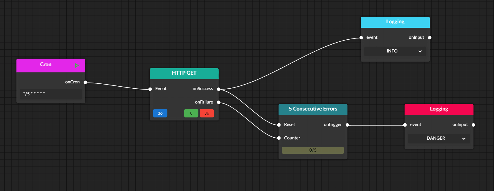
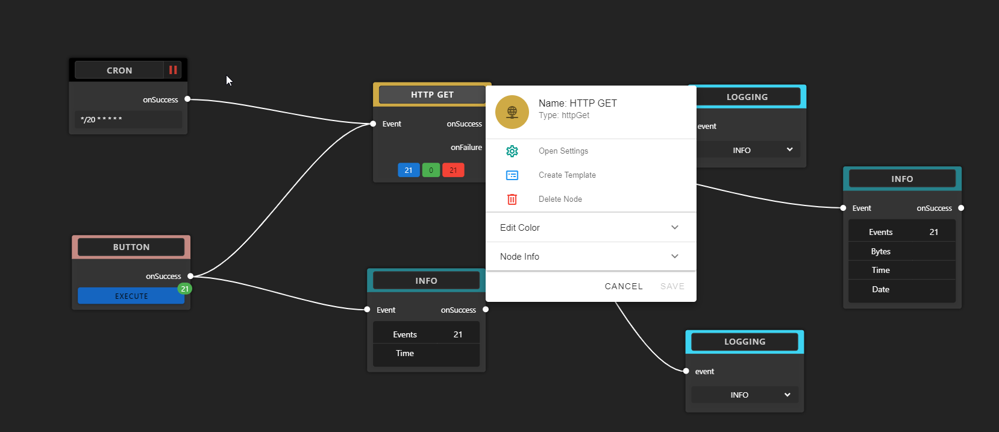

# data-graph

Application to showcase concepts and ideas for event-based data processing.
It incorporates concepts of NodeRED and ApacheNiFi and focuses on user-interaction and user-feedback to improve the users understanding of the data flow.  
Features:
* Realtime traffic indication
* Realtime error indication
* Multiple node inputs/outputs
* Interactive node editing
* Focus on usability and UX
 





## Backend
Data processing backend written in JavaScript/TypeScript executed by NodeJS.
## Frontend
Written in VueJS.
Node-Editor based on [BaklavaJS](https://github.com/newcat/baklavajs).


# Deployment

The application is fully dockerized and ca be started with ```docker-compose up```.
* The frontend and the backend are initially built. 
* Redis and MongoDB are pulled from DockerHub.


# Development

NodeJS > v12 required and npm required.

Installation of frontend:
```
cd frontend
npm install
```

Installation of backend:
```
cd backend
npm install
```

Running local instances of redis and mongo-db on default ports:
* Redis: 6379
* Mongo: 27017

For startup of both backend and frontend npm scripts are provided in respective packacke.json

## Create a Node

Nodes have to be created in the frontend and in the backend.

### Backend

1. Create folder for node category (optional: use existing folder)
2. Create file in KepapCase {nodename}-node.ts
3. Implement constructor set all required fields and call ```NodeManager.addNode(this);```  at the end of the constructor to register the instance
5. Implement the execute function. The execute function is expected to take a ```Message``` as parameter
6. Create an entry in the node-registry for the new node to register the node class

### Frontend

1. Analog to #1 of backend
2. Create file in PascalCase {NodeName}Node.js
3. Define input and output interfaces
4. Set the node type to the matching value of the node-registry
5. Define options. Default options such as color and running are required
6. Register the node in Editor.vue
